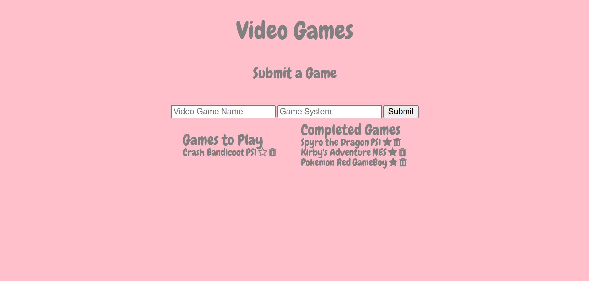

# Video Game Progress Tracker

Link to project: (https://videogameprogresslist.onrender.com/)

## How It's Made:
Tech used: EJS, CSS, JS, Node.js, Express, MongoDB

This application connects to a MongoDB database to manage a collection of video games. Users can view, add, update, and delete video games through a dynamic web interface built with EJS. The backend is powered by Express, enabling seamless routing and CRUD operations, while MongoDB handles data persistence.

## Optimizations:
- Added sorting by upvotes for displaying the most popular games first.
- Implemented upsert functionality in PUT requests to handle missing records efficiently.
- Utilized middleware for parsing JSON and URL-encoded form data to streamline user inputs.

## Lessons Learned:
- Managing state changes for resources using MongoDB operations like $set and findOneAndUpdate.
- Leveraging EJS for dynamically rendering server-side templates with database-driven data.
- Understanding the importance of error handling for database connections and CRUD operations.

## TEST IT OUT

1. run `npm install`

## Usage

1. run `npm run games`
2. Navigate to `localhost:3000`
